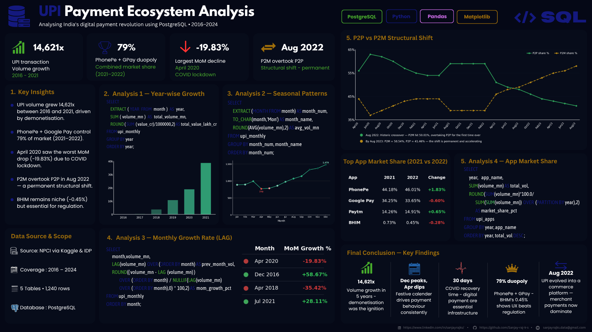

# 💳 UPI Payment Ecosystem Analysis
### Analysing India's Digital Payment Revolution using PostgreSQL (2016–2024)

---

## 📌 Overview

This project analyses India's UPI (Unified Payments Interface) ecosystem using PostgreSQL and Python. The analysis is based on real transaction data from NPCI and the India Data Portal covering 2016–2024.

The project explores:
- UPI growth trends
- Monthly and seasonal transaction patterns
- Month-on-month growth analysis
- App-wise market share
- P2P vs P2M payment behaviour changes

Advanced SQL concepts used throughout the analysis:
- CTEs
- Window Functions
- Aggregations
- Ranking Functions

---

## 🖼️ Dashboard Preview



---

## 💡 Key Insights

- UPI transaction volume grew **14,621x** between 2016 and 2021, driven by demonetisation
- **December** records the highest transaction activity almost every year
- **April 2020** saw the biggest MoM decline (−19.83%) due to the COVID-19 lockdown
- Digital payments recovered within **30 days** after lockdown restrictions eased
- **PhonePe and Google Pay** together hold 79% of the UPI market (2021–2022)
- **Merchant payments (P2M) overtook P2P** transfers in August 2022 — a permanent structural shift showing UPI's evolution into a commerce platform

---

## 🛠️ Tech Stack

| Tool             | Purpose                            |
|------------------|------------------------------------|
| PostgreSQL       | Database creation and SQL analysis |
| pgAdmin          | Query execution and CSV import     |
| Microsoft Excel  | Data cleaning and preprocessing    |
| Python           | Data analysis and visualization    |
| Matplotlib       | Charts and graphs                  |

---

## 📁 Repository Structure

```bash
UPI-Payment-Analysis/
├── README.md
├── sql/
│   ├── 01_create_tables.sql
│   ├── 02_growth_trends.sql
│   ├── 03_seasonal_patterns.sql
│   ├── 04_app_market_share.sql
│   └── 05_p2p_vs_p2m.sql
├── data/
│   ├── upi_monthly_clean.csv
│   ├── upi_monthly_2024_clean.csv
│   ├── upi_apps_clean.csv
│   ├── upi_p2p_p2m_clean.csv
│   └── imps_monthly_clean.csv
└── visuals/
    ├── upi_dashboard.png
    ├── chart1_yearly_growth.png
    ├── chart2_seasonal_pattern.png
    └── chart3_p2p_vs_p2m.png
```

---

## 📂 Datasets Used

| Dataset                    | Period           |
|----------------------------|------------------|
| UPI Monthly Transactions   | 2016–2021, 2024  |
| UPI App-wise Transactions  | 2021–2022        |
| P2P vs P2M Payments        | 2020–2023        |
| IMPS Transactions          | 2024             |

### Sources
- NPCI (National Payments Corporation of India)
- India Data Portal
- Kaggle

---

## ⚠️ Data Limitations

- UPI monthly data for 2022 and 2023 was unavailable
- App-wise transaction data for 2022 covers only January–July
- IMPS comparison is limited to 2024 data only

---

## 📝 Conclusion

The analysis shows how UPI evolved from a simple money transfer system into India's largest digital commerce infrastructure.

Key takeaways:
- Rapid adoption triggered by demonetisation in 2016
- Strong resilience and recovery during and after COVID-19
- Consistent growth in merchant-based (P2M) payments
- PhonePe and Google Pay firmly dominate the market

The most significant finding is that **merchant payments (P2M) surpassed person-to-person transfers (P2P) in August 2022** — confirming that UPI is now primarily a commerce and business payments platform, not just a fund transfer tool.

---

## 👤 Author

**Sanjay Raj K S**  
GitHub: [github.com/Sanjay-raj-k-s](https://github.com/Sanjay-raj-k-s)  
LinkedIn: [linkedin.com/in/sanjayrajks](https://linkedin.com/in/sanjayrajks)
